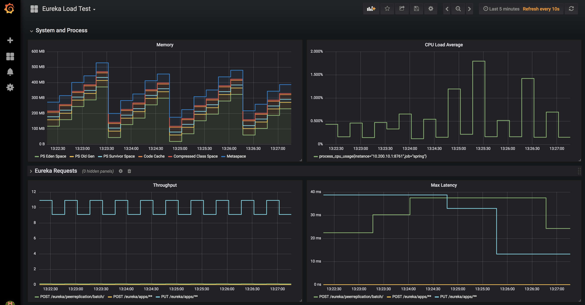

## Eureka Load Test

The purpose of this project is to provide a test harness to load test Eureka server under various resource constraints. It consists of:

 1. `EurekaRegistrations`/`EurekaBatchReplications` main classes which are intended to be pointed against a running Eureka server (modify the constant `EurekaOptios#EUREKA_HOST` to change the target).
 
 2. `EurekaApplication`, a `@EnableEurekaServer` Spring Boot application running on Spring Cloud Edgware. This application can be deployed to
 CF using variants on `./cf-push.sh`.
 
## Running the load test

Modify the parameters of the load test in `EurekaOptions`.

Run:

1. `./gradlew loadTestHeartbeats`
2. `./gradlew loadTestReplications`

The heartbeats load test must be running before starting the replications load test.

## Metrics

The `/scripts` folder includes scripts for launching Prometheus/Grafana and a preconfigured dashboard. `EurekaApplication` adds Prometheus support
and captures request traffic going into Eureka server.

The Grafana launch script automatically configures Prometheus as a datasource and adds a dashboard with a targeted visualization:

